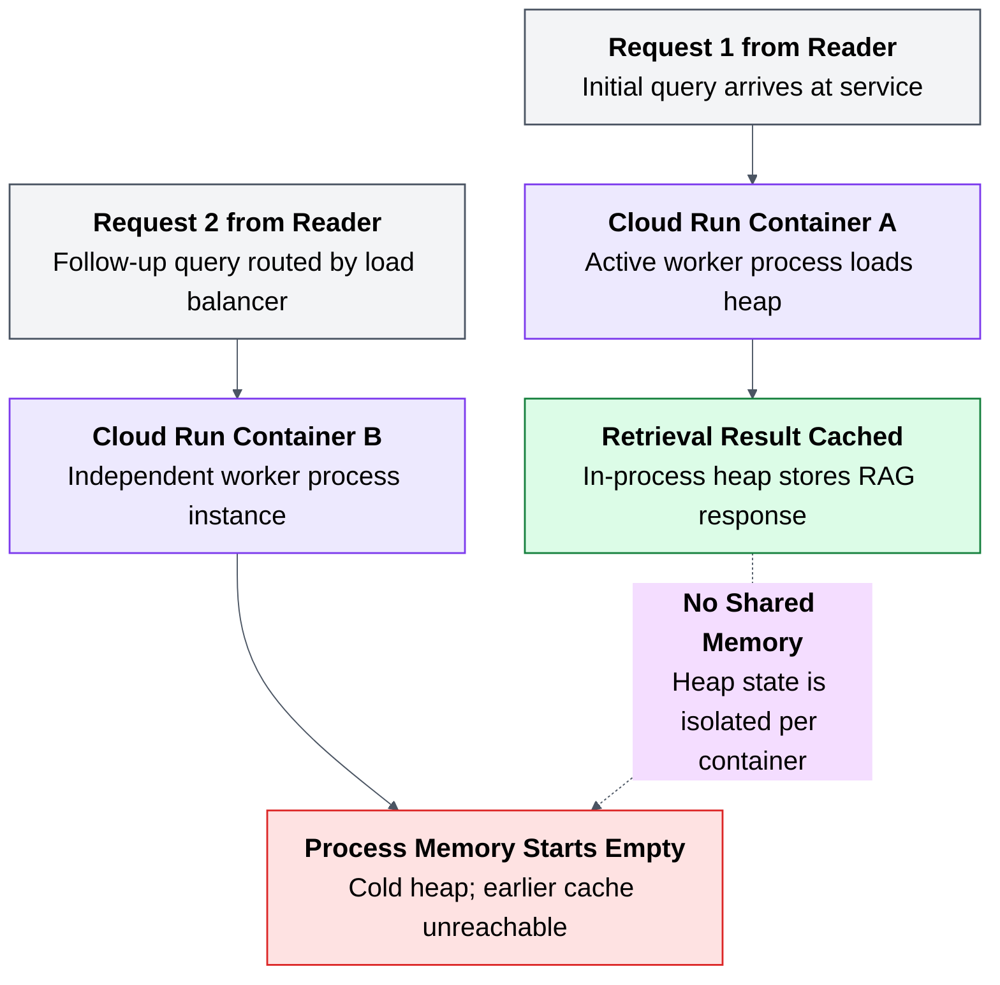

# 01. Local success, cloud failure

## Caption

Request 1 arrives at Container A. Container A fills its in-memory cache. Request 2 arrives at Container B, which has a cold cache. Container B has no access to Container A's heap. This locally-successful pattern of cache accumulation has no analog in a multi-instance deployment.

## Mermaid

## What the reader should notice

- Local success can hide a cloud deployment flaw.
- Each Cloud Run container owns its own process memory.
- The second request does not inherit the first request's cached state.
- The failure comes from the deployment model, not from Python itself.
