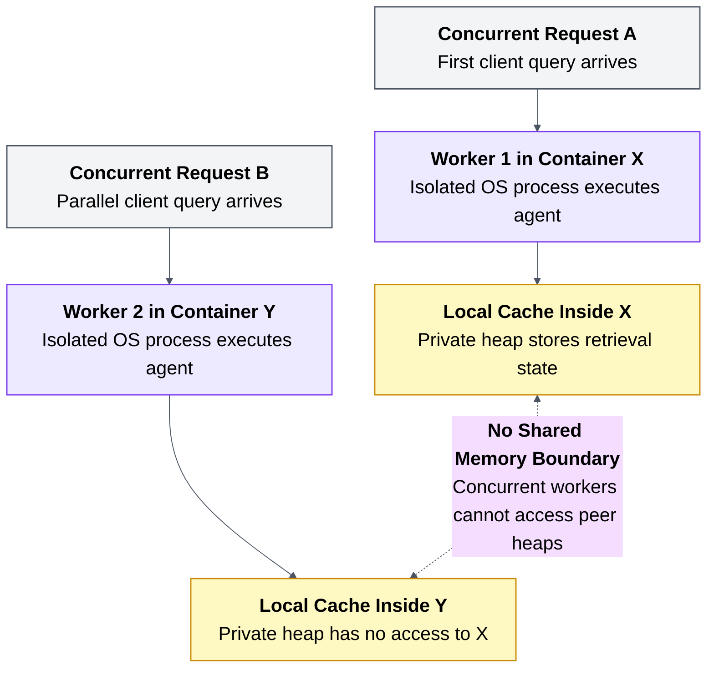

# 02. Concurrent workers do not share memory

## Caption

Concurrent Workers Do Not Share Memory. Concurrent requests multiply isolated worker memories rather than creating a shared stateful system.

## Mermaid

## What the reader should notice

- Concurrency increases the number of isolated worker memories.
- Cached retrievals and session state stay trapped inside one worker.
- A multi-worker backend is not a shared-memory system.
- This is why stateful agent servers become unreliable under real load.
