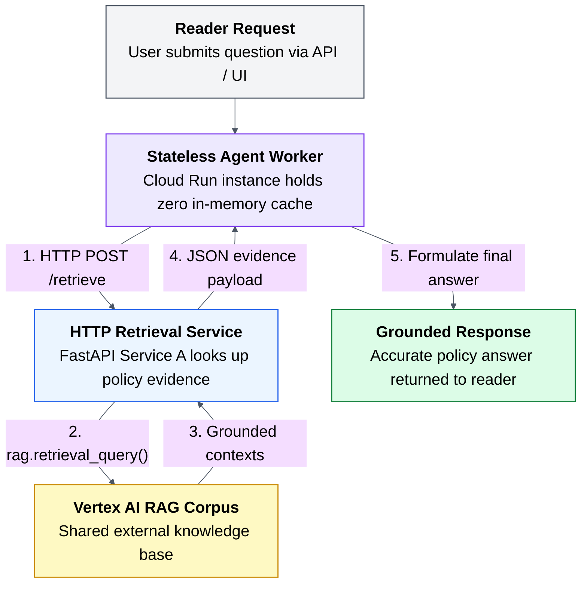

# 03. The stateless fix

## Caption

Stateless Agent Delegates Retrieval to Service A. The agent worker holds zero in-memory retrieval cache, delegating evidence retrieval via HTTP to an independent microservice backed by Vertex AI RAG.

## Mermaid

## What the reader should notice

- The agent worker keeps no mutable retrieval state between requests.
- Every request performs retrieval through the same external path.
- Consistency comes from shared external infrastructure, not from local memory.
- Any Cloud Run instance can now answer the request correctly.
