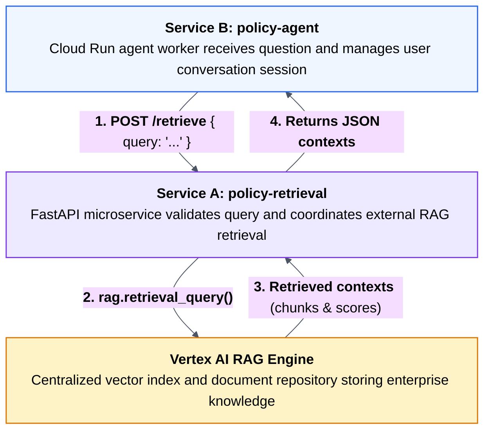

# 04. FastAPI as the retrieval boundary

## Caption

FastAPI Retrieval Service as the Stable Boundary. Service B (policy-agent) delegates retrieval to Service A (policy-retrieval) via HTTP POST /retrieve. Service A coordinates directly with the Vertex AI RAG Engine, keeping agent instances stateless.

## Mermaid

## What the reader should notice

- Service A is the place that knows how to find relevant documents.
- Service B is the place that knows how to answer the user.
- The agent no longer depends on remembering earlier retrievals in local memory.
- Every Cloud Run worker can ask the same retrieval service for the same evidence.
