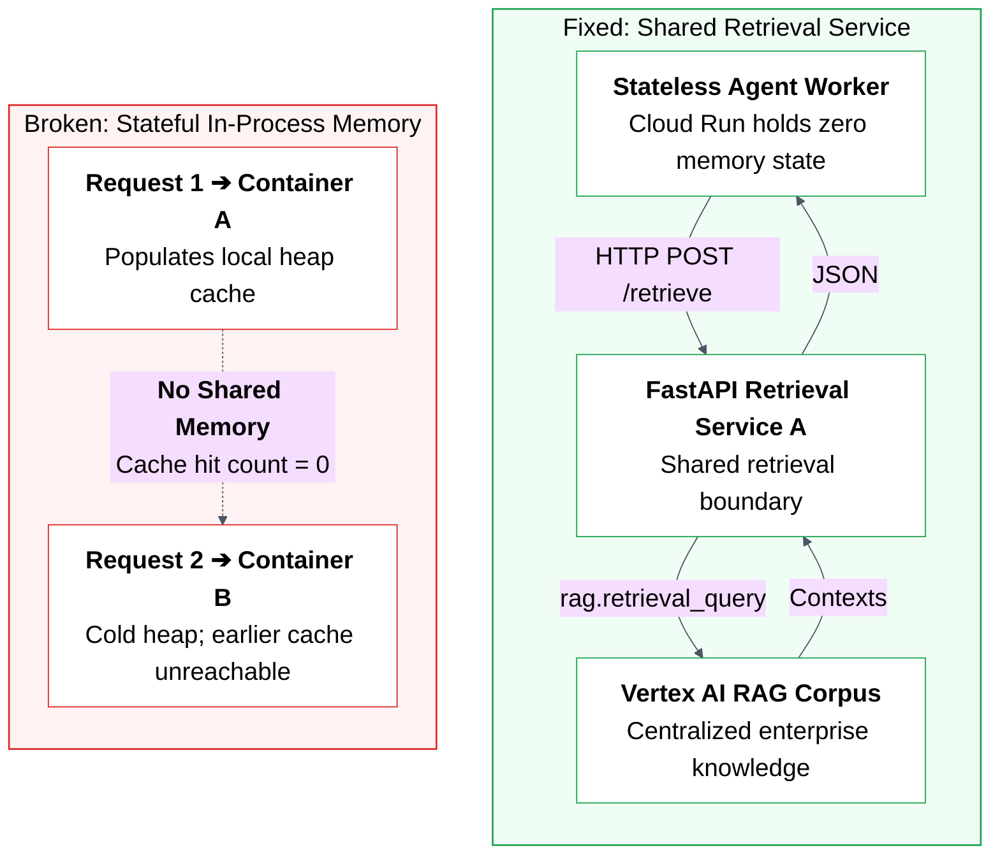

# 07. Broken architecture vs fixed architecture

## Caption

Broken architecture vs. fixed architecture. On the left, workers attempt to retain retrieval state locally in container RAM, causing cache loss across autoscaled instances. On the right, workers remain strictly stateless and delegate document lookup to a centralized FastAPI service backed by Vertex AI RAG.

## Mermaid

## What the reader should notice

- In the broken design, memory stays trapped inside one worker.
- In the fixed design, retrieval moves to a shared service boundary.
- Every worker can now reach the same retrieval system.
- The key change is architectural, not cosmetic.
