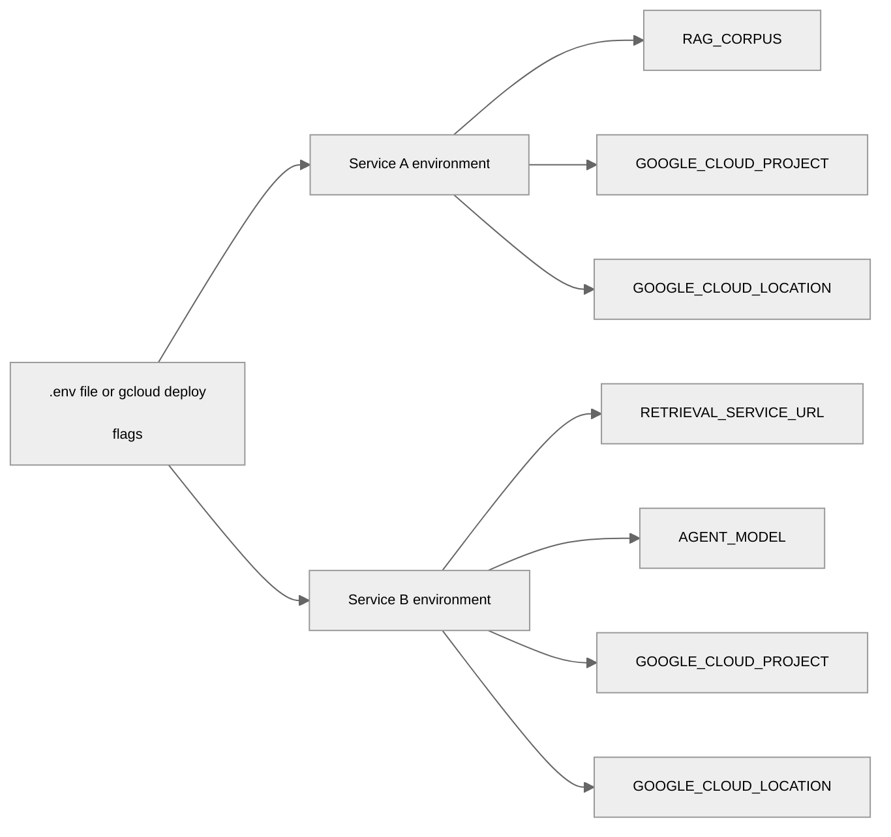

## Figure 10.6

```mermaid
%%{init: {"theme": "neutral", "themeVariables": {"fontFamily": "Arial, Helvetica, sans-serif", "fontSize": "11px", "actorFontSize": "11px", "noteFontSize": "10px", "messageFontSize": "10px"}}}%%
flowchart LR
    ENV[".env file or gcloud deploy

flags"] --> SVA["Service A environment"]
ENV --> SVB["Service B environment"]

SVA --> A_RAG["RAG_CORPUS"]
SVA --> A_PROJ["GOOGLE_CLOUD_PROJECT"]
SVA --> A_LOC["GOOGLE_CLOUD_LOCATION"]

SVB --> B_URL["RETRIEVAL_SERVICE_URL"]
SVB --> B_MOD["AGENT_MODEL"]
SVB --> B_PROJ["GOOGLE_CLOUD_PROJECT"]
SVB --> B_LOC["GOOGLE_CLOUD_LOCATION"]

```
