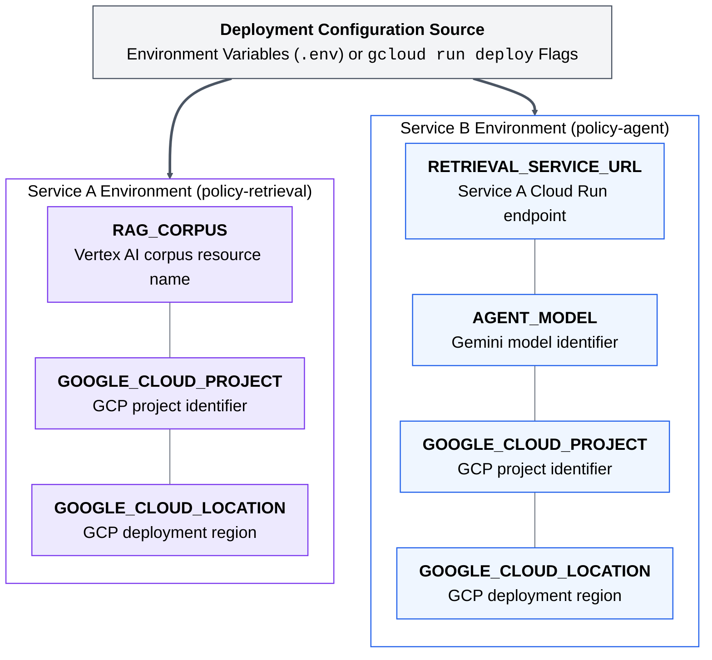

# Figure 10.6

## Caption

End-to-end request flow on Cloud Run. Environment variables wire Service A and Service B to their respective Cloud Run and Vertex AI RAG endpoints at deployment time, ensuring portable, reproducible infrastructure.

## Mermaid

